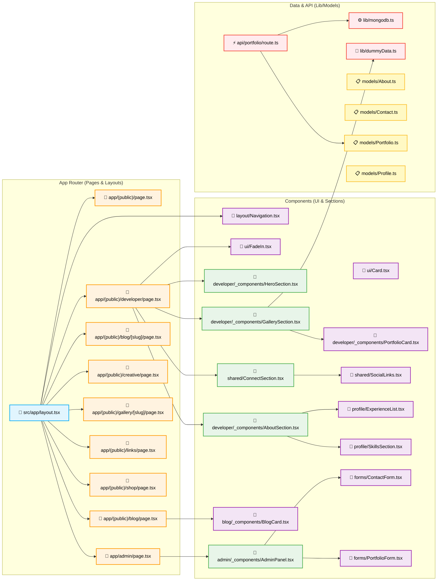

# Percabangan Import (Import Tree) di Next.js App Router

Di Next.js (terutama menggunakan App Router), arsitektur percabangan file atau *import tree* dirancang secara hierarkis (dari yang paling luas ke yang paling spesifik). 

Sistem ini mengikuti prinsip **Top-Down** dan **Modular**, di mana file di tingkat atas (seperti layout) membungkus file di bawahnya (seperti page), yang pada akhirnya akan merakit dan mengimpor komponen-komponen kecil serta data model dari folder lain.

Berikut adalah gambaran struktur *import* aktual dan lengkap dari proyek **Kaffolio** Anda, memetakan seluruh ekosistem App Router, API, Models, dan Komponen secara mendetail menggunakan visualisasi **Mermaid**:

---

### Penjelasan Setiap Lapisan (Layers) Aktual Proyek

1. **App Router Layer (Biru & Oranye)**
   *   `src/app/layout.tsx`: Bertindak sebagai *Master Wrapper* yang dipanggil pertama kali. Ini merender `<Navigation />` secara global.
   *   *Route Pages*: Meliputi semua entri URL seperti `/developer`, `/blog`, hingga `/admin`. Ini bertindak sebagai titik perakitan utama untuk setiap halaman.

2. **Section/Layout Component Layer (Hijau)**
   *   Berada dalam folder `_components` atau `shared` seperti `HeroSection`, `AboutSection`, `GallerySection`, dan `AdminPanel`. 
   *   Komponen-komponen ini berfungsi sebagai blok besar penopang tata letak spesifik halaman. Misalnya, `developer/page.tsx` menyusun *Sections* tersebut menjadi satu kesatuan.

3. **Specific Component Layer (Ungu)**
   *   Komponen UI murni dan lebih kecil (contoh: `SocialLinks`, `ExperienceList`, `BlogCard`, `FadeIn`). Komponen ini diimpor oleh *Section Component* dan seringkali dapat digunakan ulang di tempat lain.

4. **API & Data/Model Layer (Merah & Kuning)**
   *   `api/portfolio/route.ts` mengatur rute *backend*. Ini terhubung langsung dengan `lib/mongodb.ts` untuk koneksi basis data.
   *   Folder `models/` menyimpan definisi *schema* database MongoDB, yang akan digunakan oleh *API Routes* atau Server Actions.

### Kesimpulan
Pemetaan secara detail ini (dengan struktur *Left-to-Right*) secara presisi mewakili *file-system routing* aktual yang ada di dalam `src/`. Anda bisa melihat bagaimana kode dipecah (di-*split*) dalam grup rute spesifik, komponen spesifik rute (dalam folder `_components`), dan komponen modular *shared/global*.
